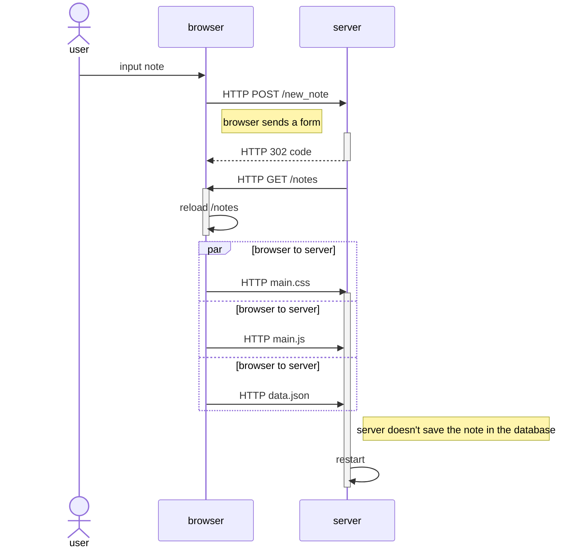

```mermaid
sequenceDiagram
    actor user
    participant browser
    participant server

    user->>browser: input note 
    browser->>server: HTTP POST /new_note
    note right of browser: browser sends a form
    activate server
    server-->>browser: HTTP 302 code
    deactivate server
    server->>browser: HTTP GET /notes    
    activate browser
    browser->>browser: reload /notes
    deactivate browser
    par browser to server
    browser->>server: HTTP main.css    
    activate server
    and browser to server
    browser->>server: HTTP main.js
    and browser to server
    browser->>server: HTTP data.json
    end    
    note right of server: server doesn't save the note in the database
    server->>server: restart
    deactivate server
```